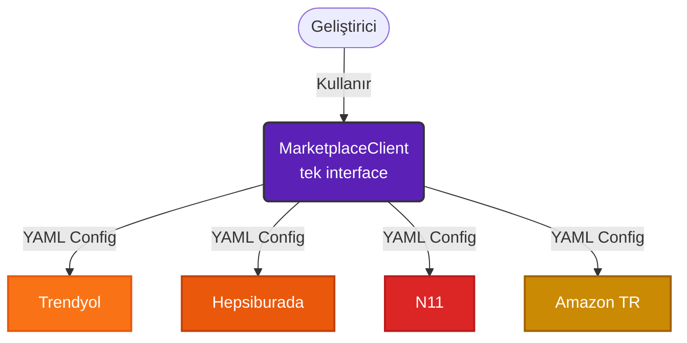

# 🛒 Marketplace SDK for Java

**Trendyol · Hepsiburada · N11 · Amazon TR** entegrasyonlarını tek bir kütüphane ile yönetin.

API değişikliklerinde Java kodu yazmak zorunda kalmayın — sadece YAML'ı güncelleyin.

[](https://openjdk.org/)
[](https://maven.apache.org/)
[](LICENSE)
[]()
[]()

---

## Neden Bu SDK?

Türkiye'deki her pazaryerinin ayrı API'si, ayrı kimlik doğrulama mekanizması ve ayrı veri formatı vardır. Trendyol bir endpoint'ini değiştirdiğinde tüm entegrasyon kodunu elle güncellemek gerekir.

Bu SDK, her pazaryerini bir `.yaml` dosyasıyla tanımlar. API değiştiğinde yalnızca YAML güncellenir — Java kodu değişmez, deployment gerekmez.



---

## Özellikler

| Özellik | Açıklama |
|---|---|
| 🔌 **Config-Driven** | Her pazaryeri YAML ile tanımlanır; endpoint, auth, field mapping |
| 🔄 **Hot-Reload** | YAML değişikliği anında devreye girer, restart gerekmez |
| 🔒 **Type-Safe** | `response.getDataAs(Order.class)` — ClassCastException riski yok |
| ⚡ **Async** | `executeAsync()` ve `executeAll()` ile paralel çoklu pazaryeri sorgusu |
| 📄 **Otomatik Pagination** | `sdk.stream()` ile tüm sayfalar otomatik çekilir |
| 🚦 **Rate Limiter** | Token Bucket algoritması — thread bloklamadan kota yönetimi |
| 💾 **Metadata Cache** | Caffeine tabanlı; TTL YAML'dan konfigüre edilir |
| 🪝 **Webhook** | Trendyol/Hepsiburada push olaylarını normalize eder |
| 🖥️ **Admin Dashboard** | Gömülü web UI; YAML editörü, diff viewer, test konsolu |
| 🏗️ **Framework Bağımsız** | Spring, Quarkus veya saf Java — fark etmez |

---

## Hızlı Başlangıç

### 1. Bağımlılığı Ekle

```xml
<dependency>
    <groupId>io.marketplace</groupId>
    <artifactId>sdk-adapters</artifactId>
    <version>2.0.0</version>
</dependency>
```

Test ortamı için mock server:
```xml
<dependency>
    <groupId>io.marketplace</groupId>
    <artifactId>sdk-test-support</artifactId>
    <version>2.0.0</version>
    <scope>test</scope>
</dependency>
```

### 2. YAML Konfigürasyonu

`marketplace-configs/trendyol.yaml` dosyasını oluşturun:

```yaml
marketplace: trendyol
baseUrl: https://api.trendyol.com/sapigw
timeoutSeconds: 30
maxRetries: 3

auth:
  type: BASIC

extra:
  supplierId: "12345"

credentials:
  apiKey: "API_KEY"
  apiSecret: "API_SECRET"
  supplierId: "12345"

rateLimit:
  permitsPerSecond: 10
  maxBurst: 20

operations:
  getOrders:
    method: GET
    path: /suppliers/{supplierId}/orders
    queryParams:
      - name: status
        type: STRING
      - name: page
        type: INTEGER
        default: 0
      - name: size
        type: INTEGER
        default: 50
    responseMapping:
      orderList:   "$.content[*]"
      orderId:     "$.orderNumber"
      orderStatus: "$.status"
      totalAmount: "$.totalPrice"

  updateStock:
    method: POST
    path: /suppliers/{supplierId}/products/price-and-inventory
    requestMapping:
      barcode:   "barcode"
      quantity:  "quantity"
      salePrice: "salePrice"
      listPrice: "listPrice"
    responseMapping:
      batchRequestId: "$.batchRequestId"

  getCategories:
    method: GET
    path: /product-categories
    cache:
      ttlSeconds: 86400   # 24 saat — kategoriler çok nadir değişir
      maxSize: 10
    responseMapping:
      categories:   "$[*]"
      categoryId:   "$.id"
      categoryName: "$.name"
```

### 3. SDK'yı Başlat

```java
MarketplaceSDK sdk = MarketplaceSDK.builder()
    .configDir("marketplace-configs")
    .adminUi(true)          // Dashboard: http://localhost:8090
    .adminUiPort(8090)
    .hotReload(true)        // YAML değişikliklerini izle
    .build();

MarketplaceClient client = sdk.client();
```

### 4. Kullan

```java
// Sipariş çek
OperationResponse response = client.execute(
    OperationRequest.builder(MarketplaceType.TRENDYOL, Operation.GET_ORDERS)
        .param("status", "Created")
        .param("size", 100)
        .build()
);

Map<String, Object> data = response.getDataAs(Map.class);
List<?> orders = (List<?>) data.get("orderList");

// Stok güncelle
client.execute(
    OperationRequest.builder(MarketplaceType.TRENDYOL, Operation.UPDATE_STOCK)
        .body(Map.of(
            "barcode",   "8681234567890",
            "quantity",  50,
            "salePrice", 299.99,
            "listPrice", 349.99
        ))
        .build()
);

// Trendyol API değişti — sadece YAML güncellendi, kod değişmedi
client.reloadConfig(MarketplaceType.TRENDYOL);

// Kapat
client.shutdown();
```

---

## Async ve Paralel Sorgular

```java
AsyncMarketplaceClient asyncClient = sdk.asyncClient();

// Tek pazaryeri — non-blocking
asyncClient.executeAsync(
    OperationRequest.builder(TRENDYOL, GET_ORDERS)
        .param("status", "Created").build()
).thenAccept(resp -> processOrders(resp));

// Tüm pazaryerleri paralel
asyncClient.executeAll(List.of(
    OperationRequest.builder(TRENDYOL,    GET_ORDERS).build(),
    OperationRequest.builder(HEPSIBURADA, GET_ORDERS).build(),
    OperationRequest.builder(N11,         GET_ORDERS).build()
)).thenAccept(responses -> merge(responses));
```

---

## Otomatik Pagination

```java
// Tüm siparişler — sayfalama detayı olmadan
sdk.stream(TRENDYOL, GET_ORDERS, Map.of("status", "Created"))
   .flatMap(resp -> ((List<?>) resp.getData().get("orderList")).stream())
   .forEach(order -> process(order));
```

YAML'da pagination tipi seçilir:
```yaml
operations:
  getOrders:
    pagination:
      type: OFFSET          # Trendyol, Hepsiburada
      # type: CURSOR        # Amazon (nextToken bazlı)
      defaultSize: 50
```

---

## Nested Request — Ürün Tanımlama

Karmaşık nested JSON payload'ları için `requestTemplate` kullanılır. `${alan}` sözdizimi ile değişkenler yerleştirilir:

```yaml
  createProduct:
    method: POST
    path: /suppliers/{supplierId}/v2/products
    requestTemplate: |
      {
        "items": [{
          "barcode":     "${barcode}",
          "title":       "${title}",
          "quantity":    ${stock},
          "salePrice":   ${price},
          "listPrice":   ${listPrice},
          "vatRate":     18,
          "images":      ${images},
          "attributes":  ${attributes}
        }]
      }
    responseMapping:
      batchRequestId: "$.batchRequestId"
```

```java
client.execute(
    OperationRequest.builder(TRENDYOL, CREATE_PRODUCT)
        .param("barcode",    "8681234567890")
        .param("title",      "Örnek Ürün")
        .param("stock",      100)
        .param("price",      299.99)
        .param("listPrice",  349.99)
        .param("images",     "[{\"url\":\"https://cdn.example.com/img.jpg\"}]")
        .param("attributes", "[{\"attributeId\":338,\"attributeValueId\":4290}]")
        .build()
);
```

---

## Webhook Alma

```java
MarketplaceSDK sdk = MarketplaceSDK.builder()
    .configDir("marketplace-configs")
    .webhook(true)
    .webhookPort(8080)
    .webhookSecret(TRENDYOL, "webhook-secret-key")
    .build();

sdk.webhookServer().onEvent(TRENDYOL, event -> {
    switch (event.getEventType()) {
        case ORDER_CREATED        -> orderService.create(event);
        case ORDER_STATUS_CHANGED -> notifyCustomer(event);
        case RETURN_REQUESTED     -> returnService.handle(event);
    }
});

sdk.webhookServer().start();
// POST /webhook/trendyol — imza doğrulaması otomatik yapılır
```

---

## Admin Dashboard

Admin UI, SDK ile birlikte gömülü Javalin sunucusu üzerinde çalışır.

```java
AdminServer server = AdminServer.builder()
    .withSDK(sdk)
    .withPort(8090)
    .withAuth("admin", "admin123")   // opsiyonel — kaldırılırsa auth yok
    .build();

server.start();
// http://localhost:8090
```

**Dashboard özellikleri:**
- Tüm pazaryerlerinin bağlantı durumu (Connected / Error)
- YAML dosyasını tarayıcıdan düzenleme
- Anlık hot-reload tetikleme
- Operasyon test konsolu
- Değişiklik diff görünümü
- Rate limiter ve cache istatistikleri

> 💡 Standalone çalıştırmak için fat-jar derlenir:
> ```bash
> mvn clean package -pl sdk-admin-ui -am
> java -jar sdk-admin-ui/target/sdk-admin-ui-2.0.0.jar
> ```

---

## Modül Yapısı

```
marketplace-sdk/
├── sdk-core/          Unified interface, SPI, domain modeller
├── sdk-config/        YAML engine, hot-reload, field mapper, cache
├── sdk-adapters/      Trendyol, Hepsiburada, N11, Amazon adapterleri
├── sdk-ratelimit/     Token Bucket rate limiter
├── sdk-webhook/       Webhook server ve normalizasyon
├── sdk-admin-ui/      Web dashboard (Javalin + fat-jar)
└── sdk-test-support/  WireMock mock server ve fixture'lar
```

Her modül bağımsız kullanılabilir:

```xml
<!-- Sadece core + config + adapters -->
<dependency>
    <groupId>io.marketplace</groupId>
    <artifactId>sdk-adapters</artifactId>
    <version>2.0.0</version>
</dependency>

<!-- Sadece webhook -->
<dependency>
    <groupId>io.marketplace</groupId>
    <artifactId>sdk-webhook</artifactId>
    <version>2.0.0</version>
</dependency>
```

---

## Desteklenen Pazaryerleri

| Pazaryeri | Auth | Sipariş | Ürün | Stok/Fiyat | Webhook |
|---|---|---|---|---|---|
| **Trendyol** | Basic Auth | ✅ | ✅ | ✅ | ✅ |
| **Hepsiburada** | Basic Auth | ✅ | ✅ | ✅ | ✅ |
| **N11** | API Key | ✅ | ✅ | ✅ | — |
| **Amazon TR** | OAuth2 (LWA) | ✅ | ✅ | ✅ | — |

Yeni pazaryeri eklemek için → [CONTRIBUTING.md](CONTRIBUTING.md)

---

## Yeni Pazaryeri Eklemek

1. `MarketplaceType` enum'una değer ekle
2. `BaseAdapter`'ı extend eden adapter sınıfı yaz (sadece `buildAuthHeaders()` implement et)
3. `AdapterRegistry.createAdapter()` switch'ine case ekle
4. `marketplace-configs/yeni-pazar.yaml` dosyasını oluştur
5. `sdk-test-support`'a WireMock stub'ları ekle
6. `mvn clean test` çalıştır

Başka hiçbir dosyaya dokunmak gerekmez. Detaylı rehber: [SKILL.md — Bölüm 12](SKILL.md)

---

## Test

```bash
# Tüm testler
mvn clean test

# Sadece belirli modül
mvn test -pl sdk-adapters

# WireMock integration testleri dahil
mvn verify
```

Test altyapısı WireMock üzerinde çalışır — gerçek API key gerekmez:

```java
@BeforeAll
void setup() {
    mockServer = new MarketplaceMockServer()
        .withTrendyol()
        .withHepsiburada();
    mockServer.start();
}

@Test
void shouldFetchOrders() {
    OperationResponse response = client.execute(
        OperationRequest.builder(TRENDYOL, GET_ORDERS).build()
    );
    assertThat(response.isSuccess()).isTrue();
}
```

---

## Gereksinimler

- Java 17+
- Maven 3.8+
- Spring, Quarkus veya herhangi bir framework zorunluluğu yok

---

## Katkı

Katkıda bulunmak için → [CONTRIBUTING.md](CONTRIBUTING.md)

PR açmadan önce:
- [x] `mvn clean test` başarılı
- [x] WireMock testleri yazılmış
- [x] Hard-coded değer yok — tüm konfigürasyon YAML'da

---

## Lisans

[MIT License](LICENSE) — Ticari kullanım dahil serbestçe kullanılabilir.

---

<p align="center">
  <sub>Türkiye e-ticaret ekosistemi için açık kaynak altyapı</sub>
</p>
